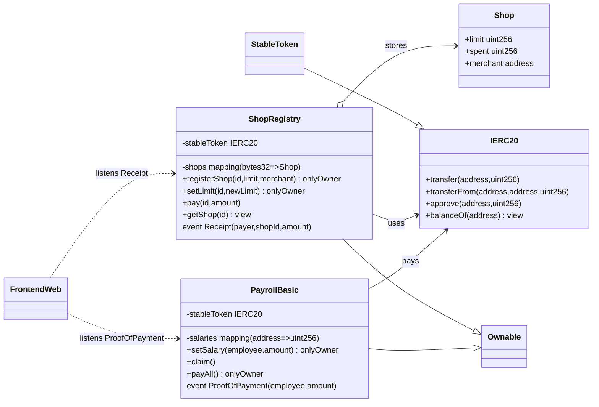

# 2025 부산테크노파크 NEXT 블록체인 과정
## 스테이블 코인 & DeFi 실전 워크숍 – 교육 설계서

> 강의 시간 7 h · 대상: 블록체인 기초 지식이 거의 없는 개발자·PM · 실습 중심 (Solidity & Next.js)

---

## 1. 강의 목표
1. 스테이블 코인의 구조와 시장에서의 역할을 이해한다.
2. Solidity로 결제·예산 분배 컨트랙트를 직접 작성·배포한다.
3. 온체인과 오프체인 연동을 경험하며, 블록체인 서비스 전체 흐름을 설계한다.
4. 강사의 실전 경험을 바탕으로 운영 인사이트와 DeFi 전략 팁을 얻는다.

---

## 2. 시간표 & 학습 흐름
| 세션 | 시간 | 형식 | 슬라이드 p.| 학습 목표 | 주요 활동 |
|-----|-----|-----|-----------|-----------|-----------|
| 0 | 10:00–10:05 | Warm-up | 1~3 | 관심 끌기, 강사 소개 | 시장 규모 그래프 애니메이션 · 퀵 퀴즈 |
| 1 | 10:05–10:30 | 강의 | 4–10 | 스테이블 코인 개념 · 사례 | 주요 스테이블 코인 모델 비교(USDC·DAI 등) |
| 2 | 10:30–11:30 | 강의+실습 | 11–25 | 결제 컨트랙트 설계 | 요구사항 → ERD 화이트보드 |
| 3 | 11:30–13:00 | 실습 | 26–45 | 코딩 & 테스트 | Hardhat deploy · wagmi 프론트 연동 |
| LUNCH | 13:00–14:00 | 자유 | – | – | 네트워킹 & 데모 영상 플레이 |
| 4 | 14:00–15:30 | 강의+실습 | 46–70 | 간단 급여 시스템 구현 | 기본 급여 등록·일괄 지급 |
| 5 | 15:30–17:00 | 실습 | 71–90 | 웹 연동(기본) | 지갑 연결·쓰기 호출·이벤트 Toast |
| 6 | 17:00–18:00 | 실습+멘토링 | 91–100 | 개인 프로젝트 피드백 | 1:1 코드 리뷰, 아키텍처 설계 조언 |

---

## 3. 세션별 상세 설계

### 세션 0: Warm-up & 오리엔테이션 (p.1)
- **Objective**: 수강생 관심 유발, 일정·목표 공유
- **Flow**
  1. ‘Stablecoin in 10초’ 모션 그래픽(시가총액 카운터 애니메이션)
  2. 강사 소개 & 실습 리포 URL QR 코드 스캔
  3. 즉석 설문(Menti) – “오늘 가장 기대되는 파트는?”
- **Tips**: 시작 3분 내 소리·조명 체크, 물리 키보드 단축키 안내(※ reveal.js `?` 헬프)

---

## 10. 코드 문법 러닝 가이드
| 슬라이드 | 문법 포인트 | 예시 코드 | 참고 링크 |
|-----------|-------------|-----------|-----------|
| 11 | SPDX-License / Pragma | `pragma solidity ^0.8.24;` | Solidity docs §Pragma |
| 13 | 상태 변수·구조체 | `struct Shop { uint256 limit; }` | OpenZeppelin Guide |
| 20 | modifier & require | `onlyOwner`, `require(msg.value>0)` | OZ Ownable |
| 28 | 이벤트 | `event Receipt(address payer,uint256 amt);` | EVM Logs |
| 32 | mapping | `mapping(bytes32=>Shop)` | Solidity mapping |
| 37 | AccessControl(선택) | `onlyOwner` 또는 간단 role | OZ Ownable |
| 50 | 이벤트 | `event Receipt(address,uint256)` | EVM Logs |

> 각 문법에는 **“한줄 해설”** 노란 주석을 포함해 슬라이드 내 `<CodeBlock>`에 표시됩니다.

---

## 11. 트러블슈팅 & 지원
1. **Metamask 연결 오류**: RPC URL 재확인 → Anvil 로컬 체인 fallback
2. **Hardhat compilation fail**: `solc 0.8.x` 버전 불일치 시 `pnpm hardhat clean && compile`
3. **Next.js 빌드 실패**: 노드 버전 20 확인, `pnpm dlx npx browserslist@latest --update-db`
4. 실습 중 Q&A 채널: Discord `#busan-next-blockchain` 실시간 답변팀 운영

---

### 세션 1: 스테이블 코인 인트로 (p.2–10)
- **Objective**: 스테이블 코인의 정의, 분류, 알고리즘·준비금 모델 비교.
- **Key Points**
  - Fiat-backed vs Crypto-collateral vs Algorithmic (UST 실패 사례)
  - 위믹스 달러의 Hybrid 준비금 구조 & 트리거 조건
- **활동**
  - Kahoot 퀴즈(5문제)로 현재 시가총액 순위 맞히기
- **Deliverables**: 용어집 한 페이지 PDF (다운로드 링크)

### 세션 2–3: 결제 컨트랙트 (p.11–45)
1. 요구사항 정의 → 상점 등록, 한도, 결제, 영수증 이벤트 (⭐ 코드 단계별 문법 설명 포함)
2. 스마트 컨트랙트 설계
   ```mermaid
   classDiagram
     class Shop {uint256 limit; uint256 spent;}
   ```
3. **코드랩**
   - StepA: `ShopRegistry` 배포 → write → read 테스트
   - StepB: 이벤트 Listen & Next.js 토스트 출력
4. **검증**: Hardhat test 4개 통과

### 세션 4: 스테이블 코인 기반 급여 지급 시스템 – 기본형 (p.46–70)
- **Objective**: 간단한 급여 지급 흐름을 구현하며 이벤트·권한·전송 로직을 익힌다.
- **시나리오**
  1. 관리자가 월별 급여표를 컨트랙트에 등록(`setSalary(employee, amount)`).
  2. 관리자 한 번의 호출로 일괄 지급(`payAll()`), 혹은 직원이 스스로 수령(`claim()`).
  3. 지급 시 `ProofOfPayment(employee, amount)` 이벤트 발행.
- **Code Walkthrough**
  ```solidity
  function setSalary(address employee, uint256 amount) external onlyOwner {
      salaries[employee] = amount;
  }

  function claim() external {
      uint256 amount = salaries[msg.sender];
      require(amount > 0, "NO_SALARY");
      salaries[msg.sender] = 0;
      stableToken.transfer(msg.sender, amount);
      emit ProofOfPayment(msg.sender, amount);
  }
  ```
- **활동**
  - 급여 등록 → 수령(클레임) → 이벤트 로그 확인까지 E2E 실습
  - 잘못된 수령 재시도 방지(0 세팅)와 require 메시지 점검

### 세션 5: 웹 연동 – 기본형 (p.71–90)
- 지갑 연결(Connect) → 컨트랙트 쓰기 호출 → 이벤트 Toast 표시
- wagmi + viem v2로 `pay`와 `claim` 버튼 구현
- 최소 UI 구성: 주소 입력, 금액 입력, 상태 Toast

### 세션 6: 멘토링 & 서비스 아키텍처 (p.91–100)
- 1:1 코드 리뷰, Gas 최적화 팁
- 온체인/오프체인 구성도 스케치 → 보안 체크리스트 제공

---

## 4. 실습 환경
- **IDE**: vscode.dev (브라우저), 실습 링크 미리 배포
- **Chain**: WEMIX Testnet + Anvil 로컬
- **Tooling**: Node 20, pnpm, Hardhat, Next.js 14

---

## 5. 강사 Profile 슬라이드 요소
- **현)** United Games 블록체인 플랫폼 개발자
- **현)** LVLUP AI 개발자
- **전)** WEMADE | WEMIX 블록체인 플랫폼 개발자
- **전)** Klaytn 메인넷 기술 연구 Grant 참여
- **전)** 숭실대학교 블록체인 연구팀
- 2022 블록체인 런 캠퍼스 강의 진행

---

## 6. 준비물 & 사전 과제
- 노트북(Chrome 최신 버전)

---

## 8. 참고 자료
- 위믹스 백서 v3.0
- Uniswap v2, v3 코드베이스
- DeFi Safety Checklist 2025

---

## 9. 글로벌·국내 규제 & 시장 동향 (세션 1 확장)

### 9.1 글로벌 규제 트렌드 (2025 기준)
| 지역 | 주요 법·가이드라인 | 핵심 포인트 |
|------|-------------------|-------------|
| EU | MiCA(‘24 발효) | 준비금 1:1 보관, 백서 공시, 역내 서비스 라이선스 의무 |
| 미국 | ‘Stablecoin TRUST Act’(초안), NYDFS BitLicense | 주·연방 이중 규제, 발행 총액 상한 논의 |
| 일본 | 자금결제법 개정(‘23) | 은행·신용카드사·신탁사만 스테이블 발행 가능, 1:1 준비금 예치 |
| 홍콩 | VASP Regime(‘24) + 스테이블 코인 프레임워크 | HKD 페깅 우선, 일일 준비금 보고 의무 |
| 싱가포르 | MAS Stablecoin Regulation(‘24) | SCS(Standard) vs LCS(Large) 이원 규제 · 시총 50M SGD 이상 보고 |
| UAE(ADGM) | DLT Foundations 규정 | 스테이블 코인 발행·청산 라이선스 구분 |

### 9.2 국내(대한민국) 규제 동향
- **디지털자산법(안)**: 스테이블 코인을 ‘결제형’·‘증권형’으로 구분, 예치금 100%+α 의무화
- **금융위 가이드라인(2024.12)**
  1. 준비금 외부 감사 보고서 반기 제출
  2. 알고리즘 방식은 ‘고위험’ 자산 분류 → 별도 투자자 적격요건
- **특금법 개정**: 발행자·보관관리업자 FATF Travel Rule 적용
- **한국은행 CBDC 실험**: e-KRW API 공개 → 스테이블 코인 ↔ CBDC 교환 파일럿 논의

### 9.3 주요 글로벌·국내 플레이어
- **글로벌**: Circle (USDC), Tether (USDT), PayPal (PYUSD), Paxos, GMO Trust, MakerDAO (DAI), Frax, Aave(GHO)
- **국내**: Wemade(위믹스 달러), Klaytn Foundation(KUSD), Shinhan·Hana Bank 합작 ‘KRWb’ 파일럿, Dunamu(UPbit) 연구 조직

### 9.4 스테이블 코인 관련 사업 영역별 시장 규모 & 사례
| 분야 | 2025E 시장 규모 | 대표 사업/사례 |
|------|---------------|----------------|
| **결제** | $1.2T 처리액 | Visa/USDC 결제, PayPal Checkout(PYUSD), Wemix Pay(게임 아이템) |
| **회계·세무** | SaaS $4B | TaxBit Stablecoin Suite, Deloitte Proof-of-Reserve, 삼정KPMG 실시간 감사 |
| **유동성 공급(DeFi)** | TVL $80B | Curve stETH/USDC, Aave GHO, WemixFi sUSDC Pool |
| **크로스체인 브릿지** | 수수료 $600M | Wormhole USDC, LayerZero OFT, Wemix Play Portal |
| **B2B 정산** | 연 $150B | Stripe Treasury, J.P. Morgan JPM Coin, Shinhan·SCB FX Stable Pilot |

> 강의에서는 위 표를 ‘썸네일 카드’ 형 슬라이드로 5장 분할 제시하고, 각 사업 영역마다 **실시간 데이터(DefiLlama·Visa Press)**를 reveal.js 코드로 fetch & 표시합니다.

---

### Revision History
| 버전 | 날짜 | 변경 내역 |
|------|------|-----------|
| 0.1 | 2025-10-13 | 최초 작성 |

---

## 12. 인터랙티브 & 게이미피케이션 설계

### 12.1 목표
- 참여형 코드 타이핑 → 즉시 피드백 → XP 보상 루프 구축
- 실습 성취 감을 극대화하여 집중도·완주율 향상

### 12.2 핵심 요소
| 요소 | 설명 |
|------|------|
| **Monaco Editor** | 슬라이드 내 임베드되는 VS Code 기반 에디터 (Solidity 언어 서버 포함) |
| **InteractiveSlide 컴포넌트** | `initialCode`, `checkFn`, `xpReward` Prop으로 구성, 코드 검증 후 Toast 출력 |
| **XP & Badge 시스템** | Zustand 상태 관리 → 우측 상단 `<XpBar>` 진행률, 레벨업 애니메이션 |
| **리더보드** | 상위 5명 닉네임·레벨 팝오버; 수료 시 POAP 뱃지 발급 |

### 12.3 동작 예시 (p.28 – modifier 학습)
1. `modifier onlyOwner() { /* TODO */ }` 코드 블록 제시
2. 수강생이 TODO 채우고 “검증” 클릭
3. `checkFn` 정규식 통과 시 XP +20, 실패 시 힌트 팝업
4. `<XpBar>`가 40→60% 상승, 레벨업 뱃지 애니메이션

### 12.4 보상 설계
- 퀴즈 정답 +10 XP (Session 1·3·5)
- 실습 테스트 통과 +20~50 XP (슬라이드 12·28·55 등 6개)
- Bug Bounty(숨겨진 버그 패치) +50 XP
- TOP 3: NFT 인증 뱃지 + 해커톤 초대권

### 12.5 구현 일정(+1.5일)
| 시간 | 작업 |
|------|------|
| Day A 오후 | Monaco + Solidity 설정, `<InteractiveSlide>` 완성 |
| Day B 오전 | XP 상태 로직, `<XpBar>`·리더보드 UI 구현 |
| Day B 오후 | 세션별 `checkFn` 작성, Toast·애니메이션 튜닝 |

> **Note:** 모든 코드 검증은 브라우저 AST/정규식 분석으로 실행되며 실제 EVM 컴파일은 하지 않습니다 (네트워크·보안 고려).

---

## 전체 컨트랙트 다이어그램 (단순화: 2 컨트랙트)

결제(ShopRegistry) + 급여(PayrollBasic) 두 컨트랙트만 포함한 기본 구조입니다.



- StableToken은 외부 ERC20(USDC/DAI 등) 구현을 가정합니다.
- 오프체인 컴포넌트(FrontendWeb)는 이벤트 구독만 수행합니다.

슬라이드 맵핑: 세션 2–3 → `ShopRegistry`, 세션 4 → `PayrollBasic`, 세션 5 → 웹 연동 기본(wagmi/viem).
